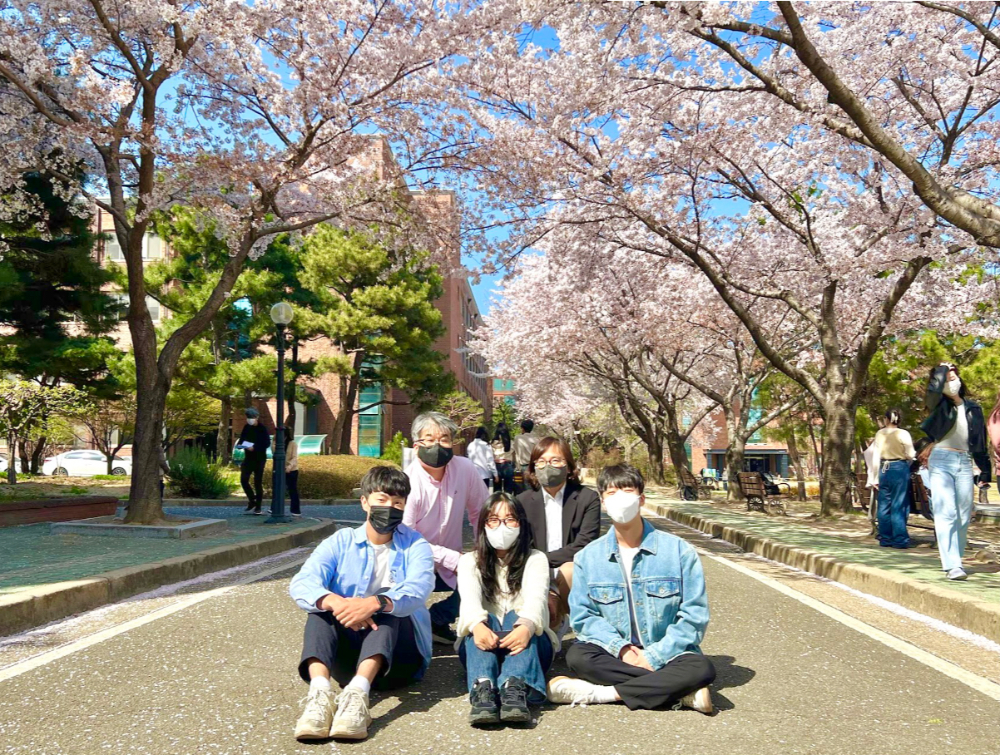

<h1 align="center"> Hello! Nice to see you 🌞 </h1>
<h5 align="center"> If you want to contact me, visit <a href="https://www.instagram.com/haeunkkim/">Instagram </a></h5>

 
<h2> 🔥 My Positions </h2>
<h5> click the images! </h5>
<table>
  <tbody>
    <tr>
      <td>
          <h6><a href="https://www.notion.so/SODA-dca6be8fff894261bb8880318303e3a7" title="소다 소개 페이지">📍 소다 소개 페이지 보러가기</a></h6>
          <h3> Soda Developer team leader (2021.06~)</h3>
          
        </a>
      </td>
      <td>
          <h6><a href="https://csee.handong.edu/2021/02/slab-%EC%86%8C%EA%B0%9C-%EA%B9%80%EA%B4%91-%EC%9E%A5%EC%86%8C%EC%97%B0-%EA%B5%90%EC%88%98%EB%8B%98-%EB%9E%A9%EC%8B%A4-wa-lab/" title="랩실 소개 article">📍 와랩 소개 아티클 보러가기</a></h6>
          <h3> Walab team Member (2021,04~)</h3>
          
        </a>
      </td>
    </tr>
  </tbody>
</table>

 
 
<h2> 👩🏻‍💻 TeckStrack </h2>

 

 
   
 
 

   
 

   

 

